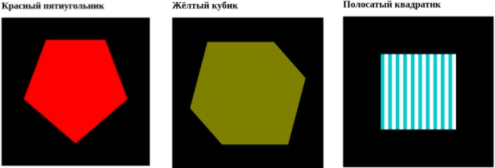

КУРС "КОМПЬЮТЕРНАЯ ГРАФИКА" 

# Тестовое задание

Используя любые известные вам методы компьютерной графики:

Постройте трёхмерную сцену, изображающую вращающийся куб.
Каждую сторону куба закрасьте основным цветом RGB.

Для запуска Требуется библиотека freeglut (freeglut 3.0.0 MSVC Package)
https://www.transmissionzero.co.uk/software/freeglut-devel/
Далее:
1. Создать папку include в папке проекта и скопировать туда папку GL.
2. Создать папку lib в папке проекта и скопировать туда файл freeglut.lib из папки lib/x64.
3. Добавить путь к freeglut.dll в "переменные среды"-> "системные переменные" -> PATH.
4. В Visual Studio: Свойства проекта -> Компоновщик -> Ввод -> Дополнительные зависимости -> lib/freeglut.lib

# Лаб.1. 2D графика в статике

Необходимо выполнить два примера из Лекции 1.
1) вывести квадрат
2) вывести треугольник

Проверить, какие из перечисленных на слайде 37 типов фигур можно использовать в webGL. Продемонстрировать результат

# Лаб.2. 2D и 3D графика в статике
Выполните следующие задания:  
Монотонно окрашенный правильный пятиугольник.  
Монотонно окрашенный кубик. (см Лекция 2 - только кубик нужен статический - динамика пока не нужна, просто поверните один раз, чтобы кубик был под углом)  
Квадрат в полоску. (см Лекция 2 - полоска по образцу клетки для кубика)   

Из 4-х кубиков создать пьедестал почета. Раскрасить каждый кубик в соответствующий цвет. Пьедестал разместить в произвольном месте сцены, отличном от центра.  

Реализовать следующие повороты:  

1) поворот каждого кубика вокруг оси, проходящей через его центр и параллельной оси Y  

2) поворот всего пьедестала вокруг оси, проходящей через его центр и параллельной оси Y    

3) поворот всего пьедестала вокруг оси Y в глобальной системе координат, т.е. проходящей через центр сцены   

(!!!Для запуска кода требуется библиотека gl-matrix (программа запускалась с помощью  Live Server ) !!!!)

